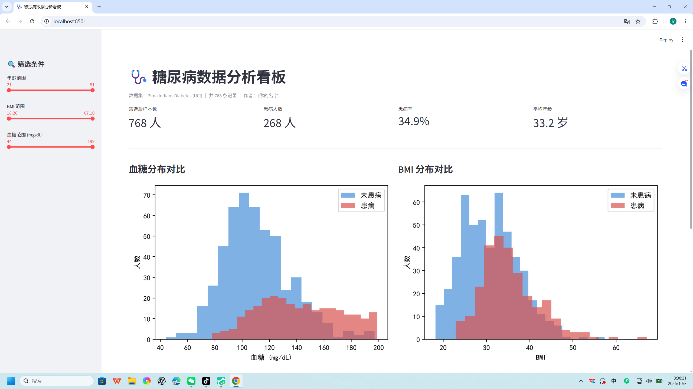
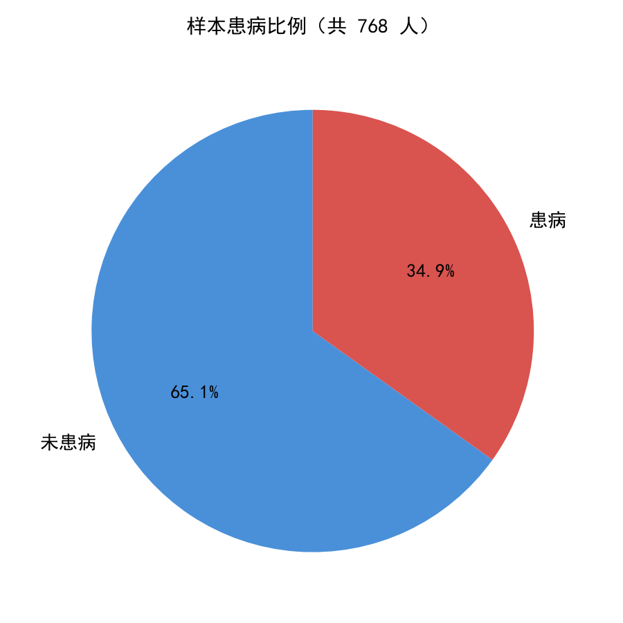
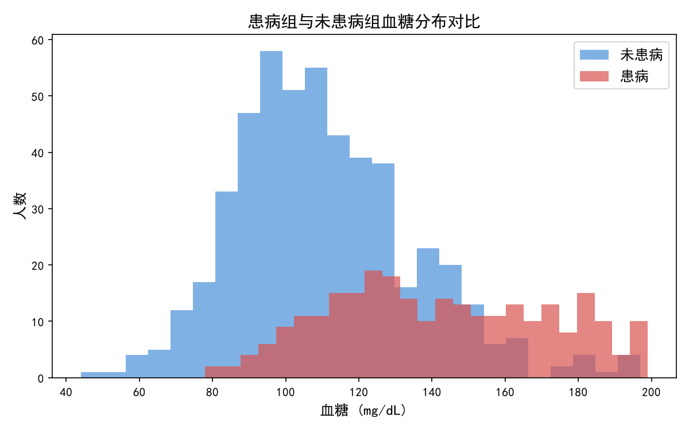
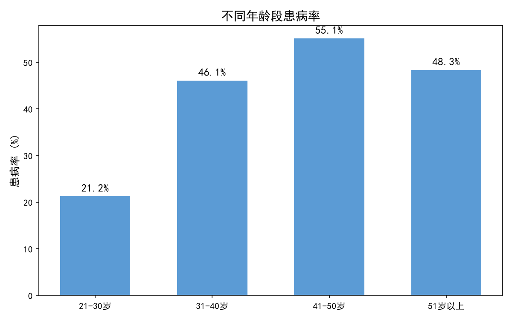
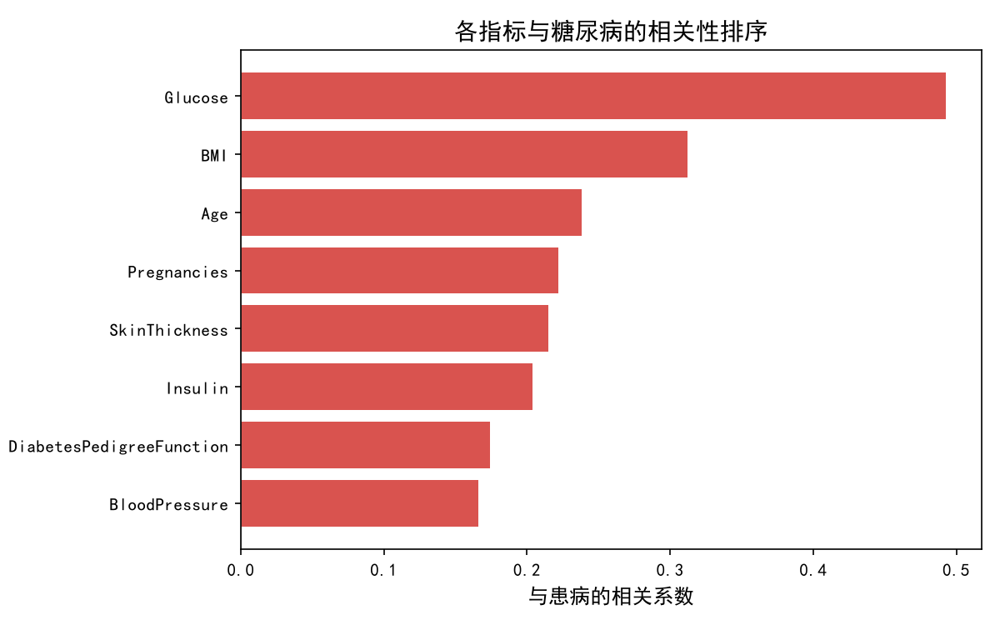

# 糖尿病数据分析与可视化系统

基于 Python 对 Pima Indians Diabetes 数据集进行完整的数据分析全流程实践，包含数据清洗、统计分析、可视化与交互式看板。

## 项目简介

本项目使用公开医疗数据集（UCI Pima Indians Diabetes，768 条记录），完成从原始数据到可视化看板的完整分析流程，重点解决原始数据中"缺失值伪装成 0"的数据质量问题。

## 技术栈

| 技术 | 用途 |
|---|---|
| Python 3.13 | 主语言 |
| pandas | 数据读取、清洗、分组统计 |
| matplotlib | 静态图表绘制 |
| Streamlit | 交互式数据看板 |

## 项目结构

```
diabetes_project/
├── data/
│   ├── pima_diabetes.csv    # 原始数据（无表头）
│   ├── diabetes.csv         # 加表头后数据
│   └── diabetes_clean.csv   # 清洗后数据
├── images/                  # 生成的图表
│   ├── 1_患病比例.png
│   ├── 2_血糖分布对比.png
│   ├── 3_年龄患病率.png
│   └── 4_相关性排序.png
├── 01_clean.py              # 数据清洗
├── 02_analyze.py            # 统计分析
├── 03_visualize.py          # 静态可视化
├── 04_app.py                # 交互式看板
├── prepare_data.py          # 数据预处理
├── requirements.txt         # 依赖清单
└── README.md
```

## 快速开始

```bash
# 1. 安装依赖
pip install -r requirements.txt

# 2. 依次运行
python prepare_data.py     # 加表头，生成 data/diabetes.csv
python 01_clean.py         # 清洗，生成 data/diabetes_clean.csv
python 02_analyze.py       # 输出分析报告
python 03_visualize.py     # 生成图表到 images/

# 3. 启动交互式看板
streamlit run 04_app.py
```

## 核心工作

1. **数据清洗**：识别出 Glucose、BloodPressure、SkinThickness、Insulin、BMI 五列中
   的 0 值为无效缺失值，使用列中位数填充，保证后续分析可靠性
2. **统计分析**：对比患病/未患病两组的关键指标差异，计算各指标与患病的相关系数，
   分析不同年龄段的患病率分布
3. **可视化**：输出患病比例、血糖分布对比、年龄患病率、相关性排序共 4 张图表
4. **交互看板**：基于 Streamlit 构建，支持按年龄、BMI、血糖三个维度动态筛选

## 主要发现

- **患病率**：768 人中 268 人患病，占比 34.9%
- **血糖是最强指标**：与患病相关系数 +0.493（强相关），患病组平均血糖 142.1 mg/dL，
  比未患病组（110.7 mg/dL）高 31.4 mg/dL
- **BMI 次之**：相关系数 +0.312（强相关），患病组平均 BMI 35.4，未患病组 30.9
- **年龄效应显著**：21-30 岁患病率 21.2%，31-40 岁升至 46.1%，41-50 岁达 55.1%
- **数据质量**：Insulin 列 48.7% 为无效 0 值、SkinThickness 列 29.6%，均已通过
  中位数填充处理，这是本项目在数据清洗环节的核心工作

## 可视化结果

### 交互式数据看板（Streamlit）



支持按年龄、BMI、血糖三个维度实时筛选，指标卡与图表联动更新。

### 静态分析图表

**1. 样本患病比例**



### 2. 患病组与未患病组血糖分布对比



### 3. 不同年龄段患病率



### 4. 各指标与糖尿病的相关性排序



## 数据局限声明

本数据集仅包含美国皮马印第安女性样本，样本量 768 条，**结论不可直接外推到其他人群**。
分析结果仅供学习与演示用途。

## 数据来源

UCI Machine Learning Repository — Pima Indians Diabetes Database (ID: 34)
https://archive.ics.uci.edu/dataset/34/diabetes
